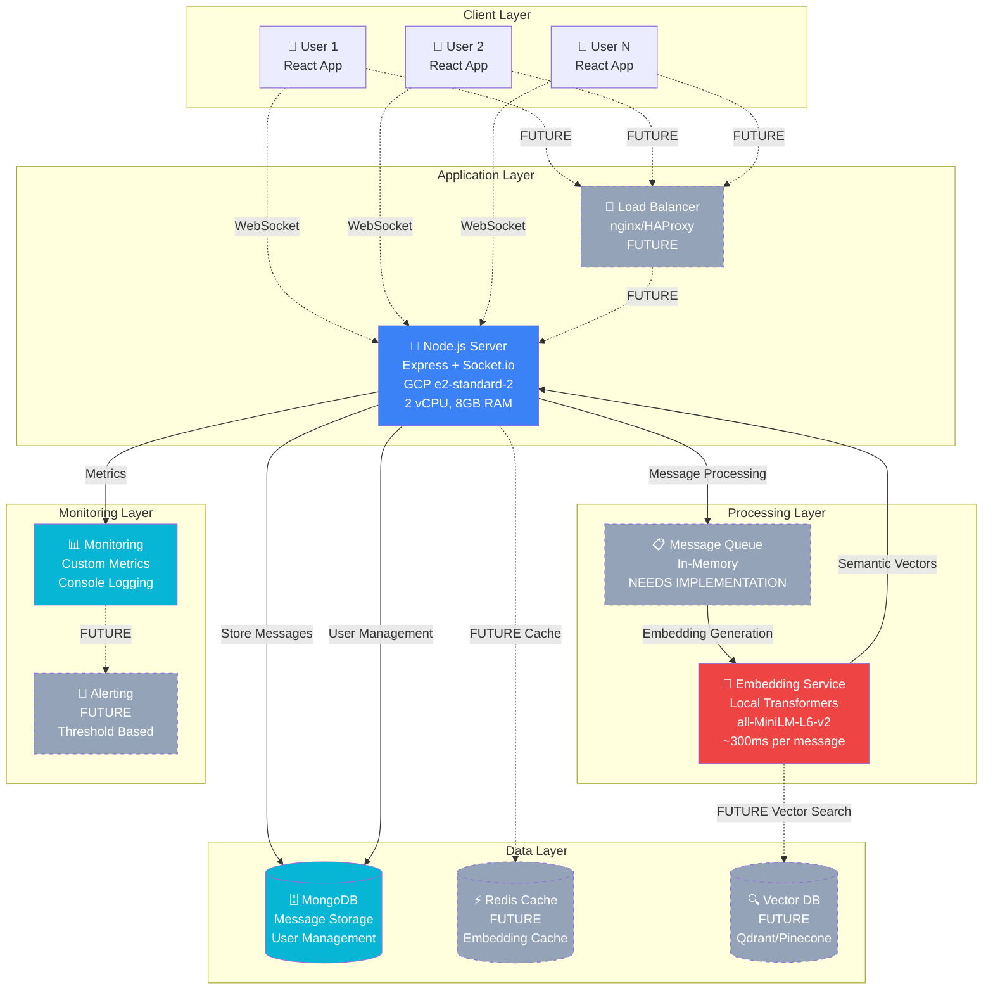
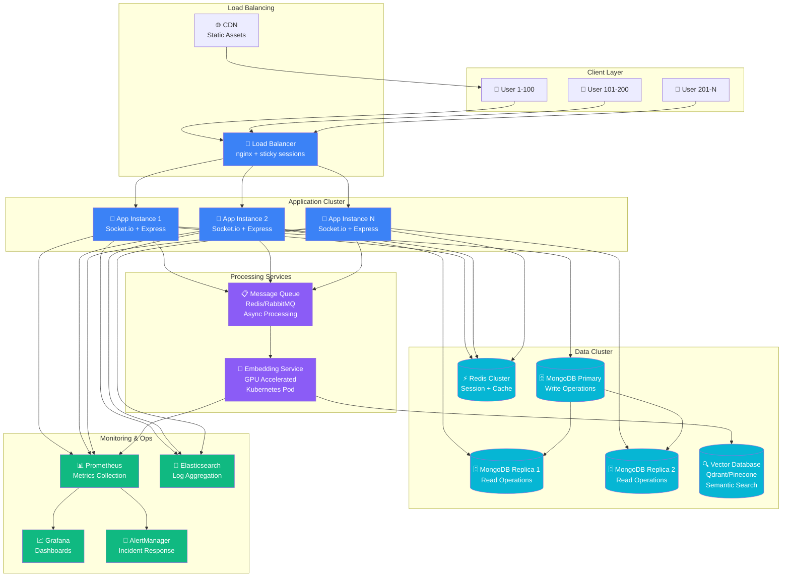

# System Architecture Diagram

## Current Architecture (Single Server)



## Scaled Architecture (Future State)



## ASCII Diagram (Simplified Current State)

```
                    CHAT APPLICATION ARCHITECTURE
                           (Current State)

    ┌─────────────┐    ┌─────────────┐    ┌─────────────┐
    │   User 1    │    │   User 2    │    │   User N    │
    │ React App   │    │ React App   │    │ React App   │
    └──────┬──────┘    └──────┬──────┘    └──────┬──────┘
           │                  │                  │
           └──────────────────┼──────────────────┘
                              │ WebSocket Connections
                              │ (Max ~1,000 concurrent)
                              ▼
    ┌─────────────────────────────────────────────────────────┐
    │              NODE.JS APPLICATION SERVER                 │
    │         GCP e2-standard-2 (2 vCPU, 8GB RAM)           │
    │                                                         │
    │  ┌──────────────┐  ┌───────────────┐  ┌─────────────┐  │
    │  │  Socket.io   │  │   Express     │  │   Metrics   │  │
    │  │  WebSocket   │  │     API       │  │   Logger    │  │
    │  │   Handler    │  │   Routes      │  │             │  │
    │  └──────┬───────┘  └───────┬───────┘  └─────────────┘  │
    │         │                  │                           │
    │         └──────────────────┼───────────────────────────┤
    │                            ▼                           │
    │  ┌─────────────────────────────────────────────────┐   │
    │  │        EMBEDDING PROCESSING PIPELINE            │   │
    │  │                                                 │   │
    │  │  Input Queue → Transformer Model → Vector DB   │   │
    │  │     (RAM)    →  (300ms/msg CPU)  →  (MongoDB)  │   │
    │  │                                                 │   │
    │  │            🚨 PRIMARY BOTTLENECK 🚨            │   │
    │  └─────────────────────────────────────────────────┘   │
    └─────────────────────────┬───────────────────────────────┘
                              │
                              ▼
    ┌─────────────────────────────────────────────────────────┐
    │                    MONGODB DATABASE                     │
    │                                                         │
    │  Collections:                                          │
    │  ├── users (authentication)                           │
    │  ├── messages (chat history + embeddings)             │
    │  └── conversations (user relationships)               │
    │                                                         │
    │  Performance: ~500-1000 writes/sec                    │
    └─────────────────────────────────────────────────────────┘

                            BOTTLENECK ANALYSIS
    ┌─────────────────────────────────────────────────────────┐
    │                                                         │
    │  🔴 CRITICAL: Embedding Generation (300ms/msg)         │
    │      └── Supports only 5-7 concurrent users           │
    │                                                         │
    │  🟡 MODERATE: Memory Usage (2KB/connection)            │
    │      └── Supports ~3,000 concurrent connections       │
    │                                                         │
    │  🟢 MINIMAL: Database Writes (10ms/msg)                │
    │      └── Supports ~500 messages/second globally       │
    │                                                         │
    └─────────────────────────────────────────────────────────┘
```
